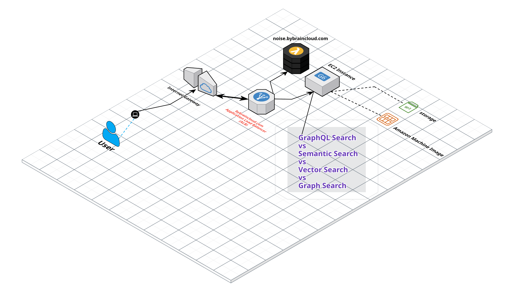
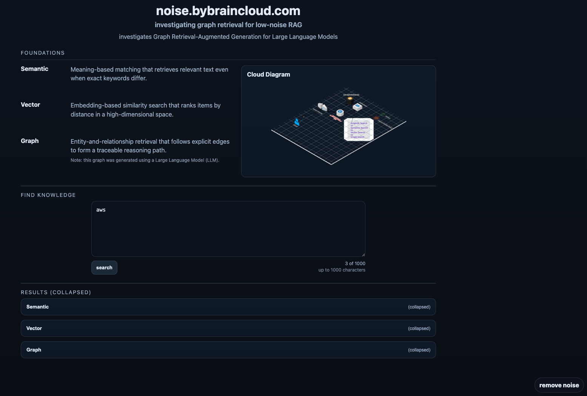
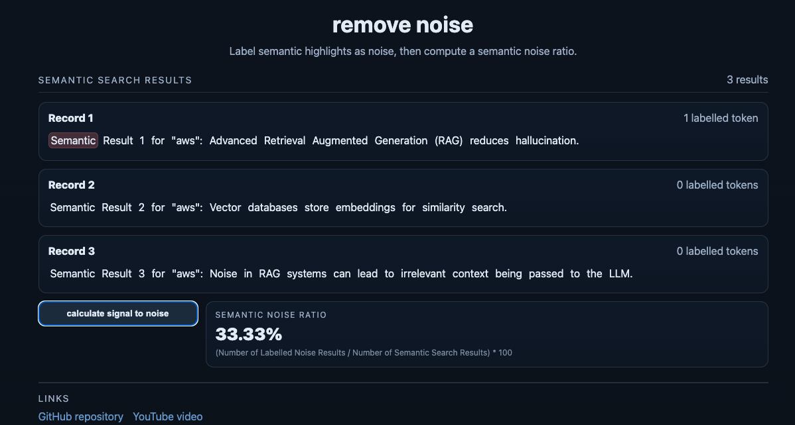
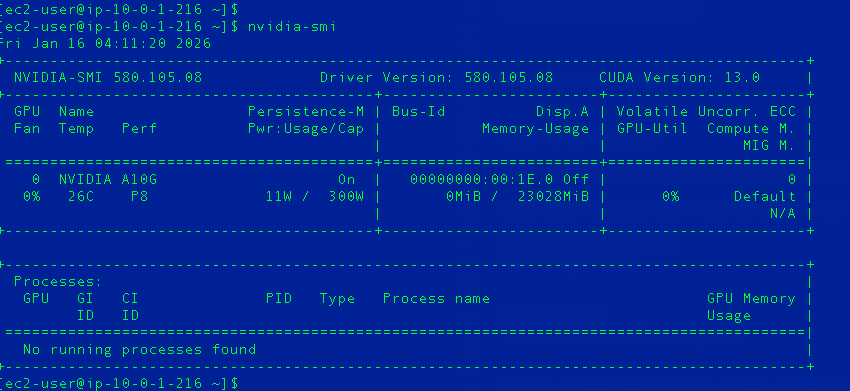

# noise.bybraincloud.com
[noise.bybraincloud.com](https://noise.bybraincloud.com)

investigates Graph Retrieval-Augmented Generation for Large Language Models


[https://ieeexplore.ieee.org/abstract/document/10771030](https://ieeexplore.ieee.org/abstract/document/10771030)

**Special** _Thank you_ to 

`Dr. Tyler Thomas Procko`

Department of Electrical Engineering and Computer Science, 
Embry-Riddle Aeronautical University, Daytona Beach, United States of America


`Dr. Omar Ochoa`

Department of Electrical Engineering and Computer Science, Embry-Riddle Aeronautical University, Daytona Beach, United States of America


[go eagles](https://eraueagles.com/)

## Architecture Diagram from Cloudcraft:





Created with help from 🤖 [Google Antigravity](https://antigravity.google/)


Note: AI enhanced the deployment of this site 🤖


Visit here:  [noise.bybraincloud.com](https://noise.bybraincloud.com)


## Screenshots 






Visit here:  [noise.bybraincloud.com](https://noise.bybraincloud.com)


## Amazon EC2 Instance Type and Machine Image (AMI)


## Check for GPU 





## Local Development Setup: 

1. Clone the repository:
`git clone https://github.com/drumadrian/noise.bybraincloud.com.git`
`cd noise.bybraincloud.com`


2. Install dependencies:
`npm install`

3. Set up environment variables:
`cp .env.example .env`

4. Run the server:
`npm run dev`


## EC2 Instance Setup: 


login to EC2 instance: 

`ssh -i "noise.pem" ec2-user@IP_ADDRESS.us-west-2.compute.amazonaws.com`

Note: Security Group must allow SSH access from your IP address.

instance type: t3.medium
EBS storage: 100GB


Install the full stack:

1. Clone the repository:
`git clone https://github.com/drumadrian/noise.bybraincloud.com.git`
`cd noise.bybraincloud.com`

2. Setup permission for the deploy script:
`chmod +x deploy.sh`

3. Run the deploy script:
`./deploy.sh`


---

# 🎥 Comparing Search Methods: OpenSearch, Weaviate, and Neo4j for Low-Noise RAG 🎥

## Welcome Video
[](https://www.youtube.com/watch?v=faSx8Qbn7VA)


---


## 📄 Thesis & Dissertation Text *(structured, not written)*

```markdown
## 📄 Full Thesis & Dissertation

The structured thesis and dissertation content lives here:

➡️ [thesisREADME.md](./thesisREADME.md)

```


---
---
---
fin


