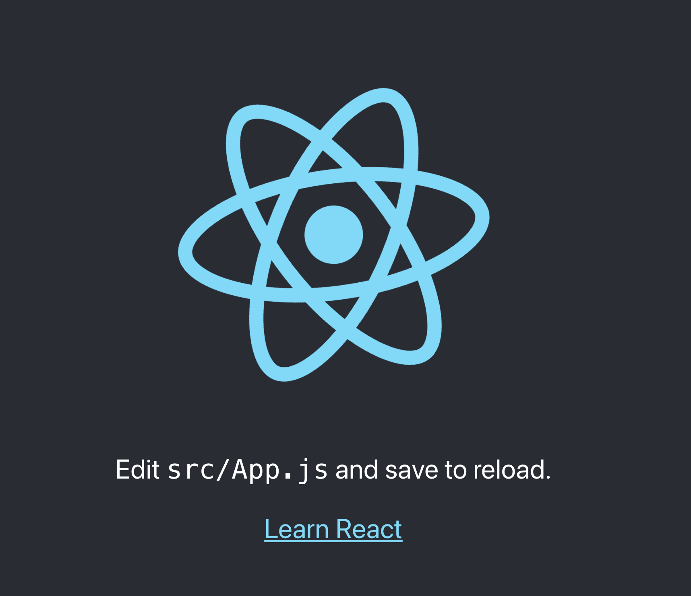

# noise.bybraincloud.com
investigates Graph Retrieval-Augmented Generation for Large Language Models


## Architecture Diagram from Cloudcraft:


Created with help from 🤖 [Google Antigravity](https://antigravity.google/)


Note: AI enhanced the deployment of this site 🤖


Visit here:  [noise.bybraincloud.com](https://noise.bybraincloud.com)


## Screenshot 





Visit here:  [noise.bybraincloud.com](https://noise.bybraincloud.com)


## Amazon EC2 Instance Type and Machine Image (AMI)


amiandtype.png


## Check for GPU 


## EC2 Instance Setup: 


login to EC2 instance: 

`ssh -i "noise.pem" ec2-user@IP_ADDRESS.us-west-2.compute.amazonaws.com`

Note: Security Group must allow SSH access from your IP address.

instance type: t3.medium
EBS storage: 100GB


Check Postgres  
`sudo systemctl status postgresql`


We have a postgresql database running on port 5432

```
host: localhost
port: 5432
user: wikijs
pass: wikijsrocks
db: noise
  ssl: false
```


Install the full stack(copy the deploy.sh file to the EC2 instance and run it):  
`./deploy.sh`


---
---
---
fin


