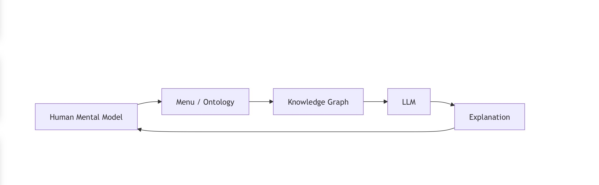
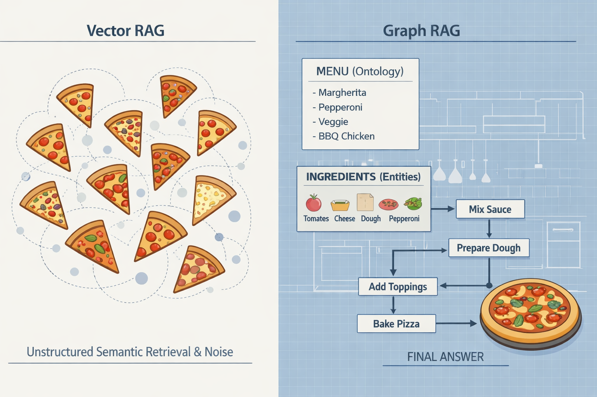
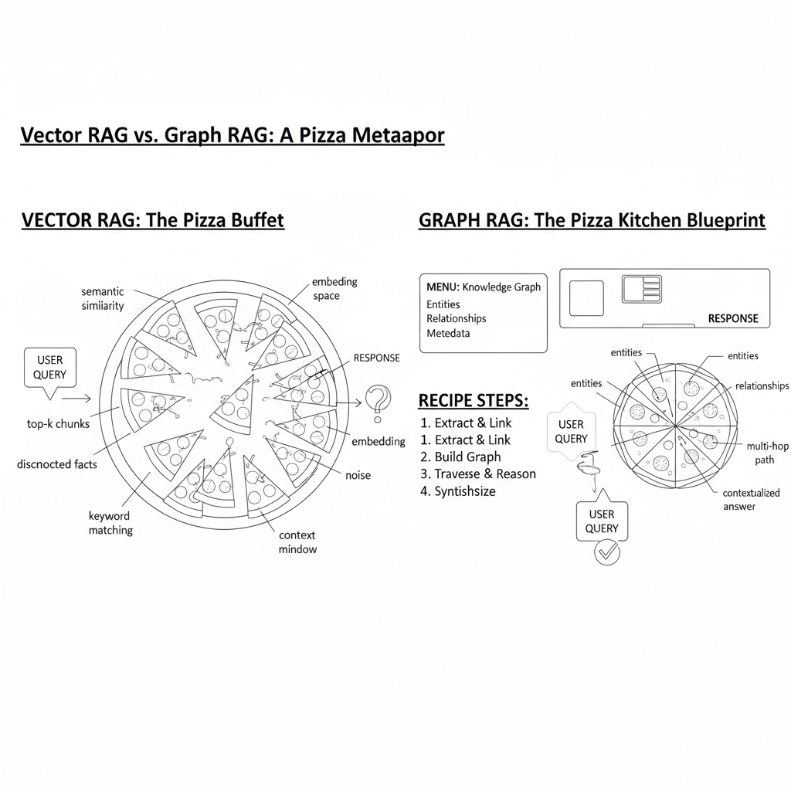

# 📘 future Dr. Adrian’s Dissertation
*(structured, not written)*

---

# 🧠 NeurIPS / ICML–Style Problem Setting

### Problem Setting

Large Language Models (LLMs) increasingly rely on Retrieval-Augmented Generation (RAG) to ground responses in external knowledge. Most deployed RAG systems retrieve unstructured text passages using vector similarity search, which optimizes for semantic proximity but does not explicitly model relationships between retrieved facts.

This design introduces two challenges:

1. **Noise accumulation:** Retrieved passages may be semantically similar yet irrelevant to the reasoning task.
2. **Opaque reasoning:** The lack of explicit structure prevents inspection of how individual facts contribute to final answers.

Multi-hop reasoning tasks exacerbate both issues, as correct answers often require combining multiple interdependent facts that are not co-located in a single text chunk.

Graph-based retrieval approaches offer an alternative by modeling knowledge as entities and relations, enabling retrieval of connected subgraphs rather than isolated passages. However, graph-structured systems introduce complexity that is often inaccessible to non-expert users.

This work investigates whether **graph-guided retrieval can reduce noise and improve multi-hop reasoning reliability**, and whether **human-centered structural abstractions** can make such systems interpretable without sacrificing performance.

---

Contact: 
📧 adrian@adriandrummond.com 

🛜 https://adriandrummond.com

⛓️💥 https://linkedin.com/in/adrian-drummond 📣

*(structured, not written)*

I am **Adrian**.

This repository contains the **conceptual structure, abstractions, and evaluation framing** for my Master’s thesis and PhD dissertation.
The goal is to lock down **what is being studied and why**, before writing prose or running experiments.

---

---

# Adrian’s Thesis & Dissertation Video 🎥

## Thesis & Dissertation Overview

---

## 🧪 Thesis — System & Evidence (Master’s)

**Working title (subject to change):**

> **Evaluating Noise and Multi-Hop Reasoning in Vector vs Graph Retrieval-Augmented Generation Systems**

**Nature of work:**

* Empirical
* Comparative
* Bounded
* Measurable

**Core thesis question:**

> *Can graph-structured retrieval reduce noise and improve multi-hop reasoning reliability compared to vector-based retrieval under equivalent model and data conditions?*

---

## 🧠 Dissertation — Framework & Theory (PhD)

**Working title:**

Initial diagram:

> **Menu-Based Explainability: Human-Centered Structural Abstractions for Interpretable AI Systems**

**Nature of work:**

* Conceptual framework
* Structural design theory
* Human-centered explainability
* System-level abstraction

---

## 🍕 Intuition (Pizza-Friendly, Research-Serious)

* 🍕 **Master’s Thesis** = *One perfect slice*

  > “Can we show that Graph RAG reduces noise compared to Vector RAG?”

* 🍕🍕🍕 **PhD Dissertation** = *The whole menu*

  > “How can complex AI systems be made structurally explainable to humans using familiar abstractions?”

---

## 🧩 Core Mental Model

| Layer                   | Question it answers                     |
| ----------------------- | --------------------------------------- |
| **Vector RAG**          | “What text feels similar?”              |
| **Multi-hop Retrieval** | “What facts must be combined?”          |
| **Graph RAG**           | “How are facts structurally connected?” |
| **Chain of Thought**    | “How should the answer be explained?”   |

> Retrieval structure and explanation format are **separable concerns**.

---

## 🍕 Pizza → RAG / Graph Mapping (Expanded)

| Pizza Concept                       | RAG / Graph Concept                                           |
| ----------------------------------- | ------------------------------------------------------------- |
| Menu                                | Schema / Ontology                                             |
| Section                             | Subgraph / Topic                                              |
| Topping                             | Entity                                                        |
| Ingredient                          | Atomic fact                                                   |
| Recipe                              | Reasoning path                                                |
| Order                               | Query                                                         |
| Chef                                | LLM                                                           |
| Kitchen Blueprint                   | Knowledge graph                                               |
| Buffet                              | Vector RAG result set                                         |
| **Single pizza made from a recipe** | **A concrete answer assembled via a specific reasoning path** |

**Important distinction:**

* The *menu* defines what is possible
* The *recipe* defines how one specific answer is constructed
* The *pizza* is the final generated output, grounded in structure

---

## 🧠 Central Dissertation Claim

> **LLMs fail not because they lack intelligence, but because they lack structured context.**

* Vector RAG provides **content without organization**
* Graph RAG provides **organization without overload**
* Human-familiar abstractions (menus, recipes) make structure:

  * explainable
  * inspectable
  * visualizable

This claim motivates **menu-based explainability** as a design principle.

---

🎨 Custom Diagrams

ChatGPT diagram:

Gemini diagram:

## ❓ Core Research Question (Intentionally Open)

> *What structural abstractions allow humans to understand, audit, and trust multi-step AI reasoning without requiring expertise in graph theory or machine learning?*

---

---

# 🧠 Mapping Pizza to Graph 🍕
This work investigates whether **graph-guided retrieval can reduce noise and improve multi-hop reasoning reliability**, and whether **human-centered structural abstractions** can make such systems interpretable without sacrificing performance.

---

## ✅ Status

* ❌ Not written
* ✅ Structurally defined
* ✅ Reviewer-defensible
* ✅ Research-grade abstraction
* ✅ Ready for experimentation and figures

---
---
---
fin

